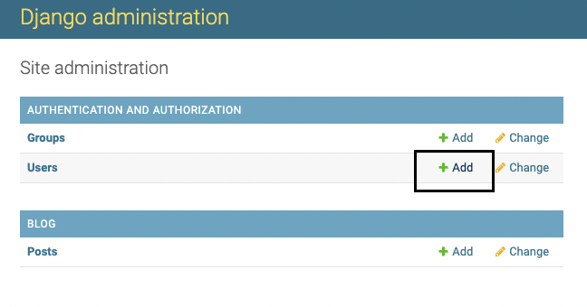
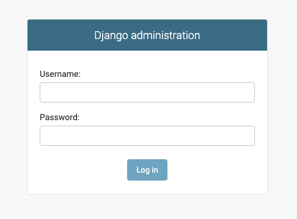
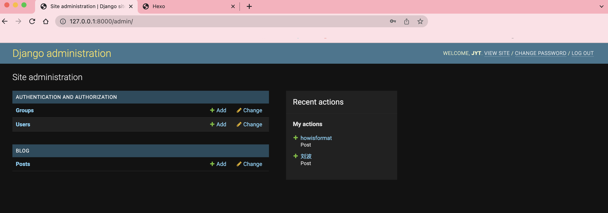
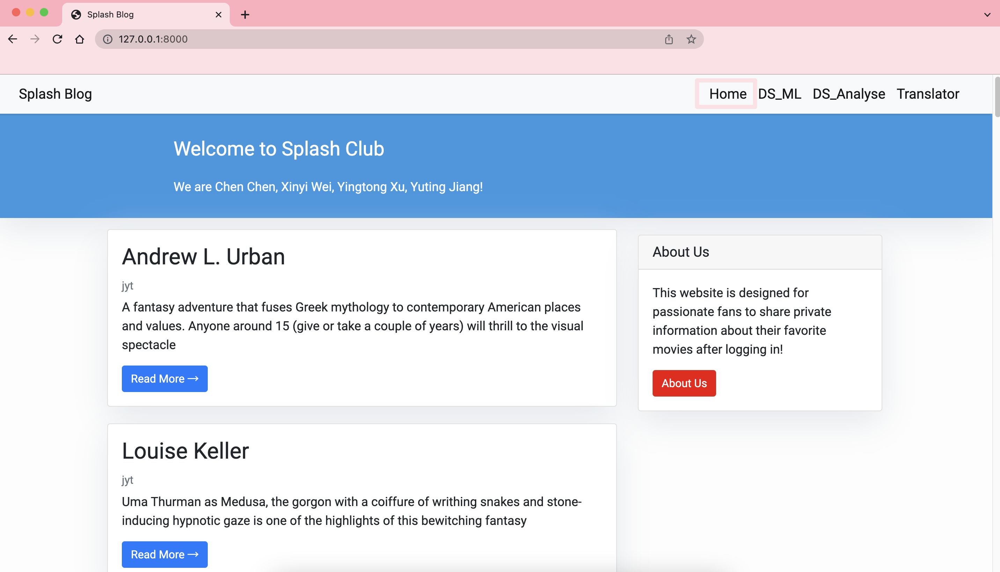
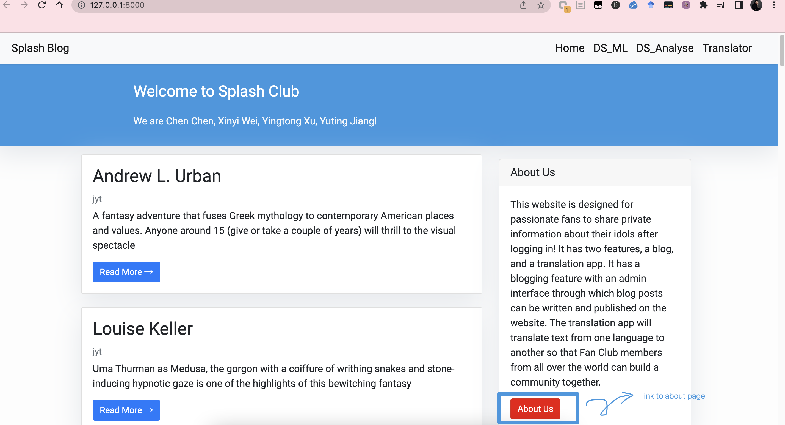
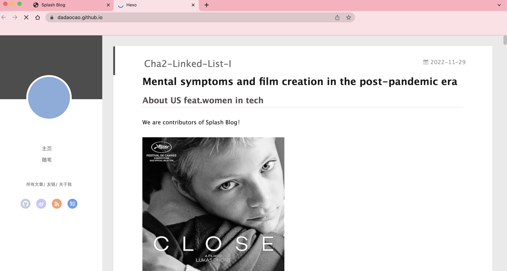
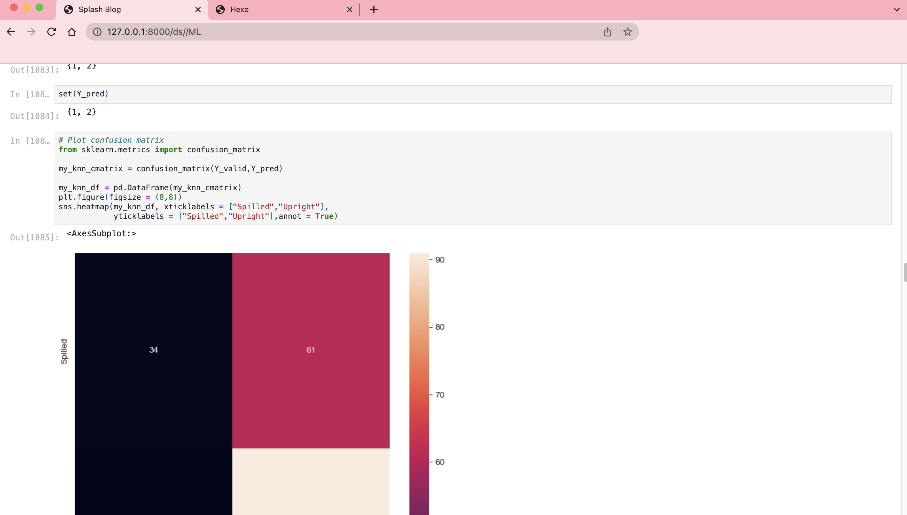
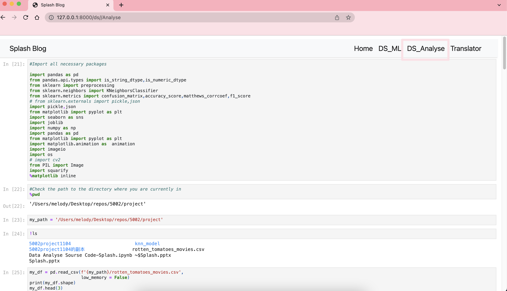
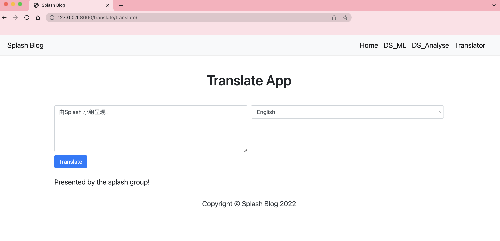

# Hollow: An Online Masked Ball 🎭
## Presented by Group WW
Xinyi Wei ❤
Xinan Wang ❤

## Quick Overview
### Completed Feature
- Blog feature with an admin interface through which organization members can log in and then write & save & publish new **blog posts** to the website.
- **Translator** function which people can translate text from one language to another.
- Interfaces that show our exploring of niche areas via data analysis, machine learning, and visualization of **movie** data.

### In-Progress Feature
- Design the database
- Log in as an organization member instead of an individual

### Future Feature
- Resisting the Crisis of Anonymity: Balance between security and anonymity
- “You may be interested in……” recommendation system
- Cooperate with psychological institutions and psychological counselors
- Message in a bottle

## Requirements
python >= 2.5 

pip >= 0.8

django >= 3.2 (tested with Django 1.6 and Django 1.7)

pip install squarify

pip install googletrans==4.0.0-rc1

p.s. The package that needs to be imported to implement data science, data visualization, and machine learning has been presented in the source code (Data Analyse Sourse Code-Splash.ipynb)

python manage.py runserver   

## Function
creat new user

user log in

user profile page

visit blog homepage

click here to jump in about page

visit about page

visit data_scienc(ML) page

visit data_scienc(DS) page

visit translate page

## Function Display

## Example for background test super user:
Username: liuber
Password: 1234

## Skills
Python
Django
HTML
Machine Learning
Data Analyse

## Contribution
All team members implement our own edition. Help each other debug, code review, discuss, improve, share, prepare for the final presatation.

## Presented by Group 2 Splash
